[cato_link]: https://github.com/ddimos/Cato

# What a Year of Side-Project Development Looks Like
Throughout 2025, I worked on a side [project][cato_link]. This is a simple multiplayer game based on my and my friends' favorite card game. Every time I worked on it, I recorded the amount of time I spent on it.
In this article, I wanted to analyse the data I got, find some patterns, and just see what this year looked like.

***

Why did I decide to track my time? I wanted to see how many hours I could realistically dedicate to a side project, working evenings and weekends, while still having a full-time job and a fulfilling life.

I kept all the data in a simple text file. Each entry contains: 

* start time
* end time
* estimate of how much time I actually spent 
* a short description of what I was doing. 

As for the last one, I wasn't very consistent, so I won't include it here. (Even though it would be interesting to analyze it too).

```
30.06.25 21:20-01:00 ~2.5h
01.07.25 22:30-23:30 ~1h
23.06.25 21:10-21:50 ~40m
```

**Note 1:** Throughout the article I'll be using start and end times to make analysis and later I'll compare it to the actual time I spent.

**Note 2:** I created a lot of charts, not all of them are really necessary. I love making charts!

# Data
## General Stats

Let's start by looking at the heatmap.

<div align="center">
  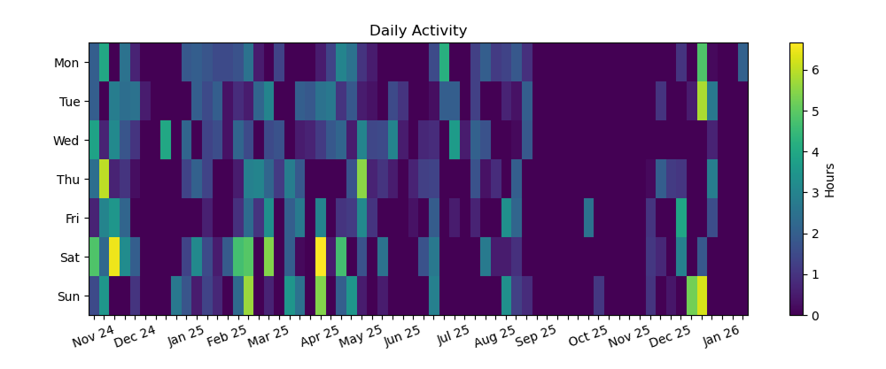
  <p><em>Figure 1.1 Daily Activity Heatmap</em></p>
</div>

I started the project on **04-11-2024** and my last entry is on **19-01-2026**. That's a total of **441** days. I was working on **214** of these days. So we can say it was every other day.

The next chart shows the cumulative number of hours worked over the entire period.

<div align="center">
  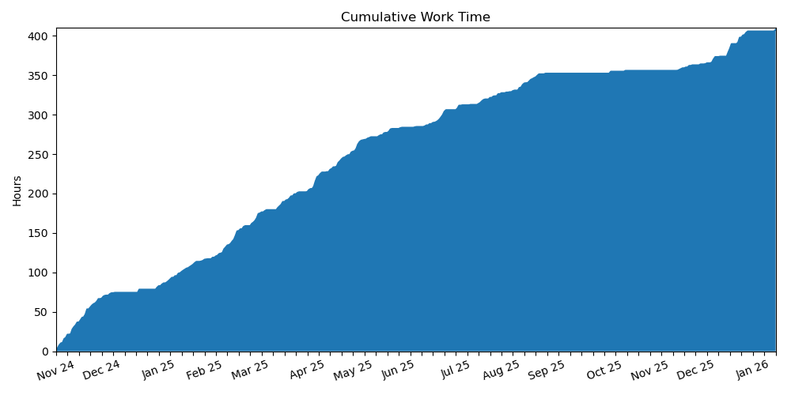
  <p><em>Figure 1.2 Cumulative Work Time</em></p>
</div>

In total I logged **408** hours. That's equal to **50** full working days (8 hours per day) or **2.5** working months (21 days per month). It doesn't seem like much at first, until I look at the heatmap. And it did indeed feel like I spent many days on the project.

It's interesting to watch these two charts over timeline. The first month was extremely productive, I was working on pure enthusiasm. Then came the Christmas break. After that, there was a really long period of consistent progress. During the summer, the gaps become larger, followed by two months of no work at all. I remember feeling completely burnt out and not even wanting to touch the game. Eventually the motivation returned and I decided to bring the project to the functional prototype it is today.

## Stats per Day

The next histogram shows the distribution of total time spent per day.

<div align="center">
  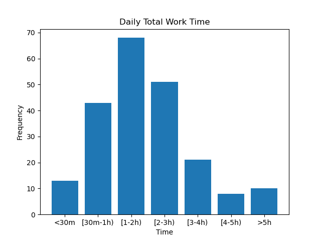
  <p><em>Figure 2.1 Daily Total Work Time</em></p>
</div>

Most workdays were relatively short, it had only one-two hours of work. On average, I spent **1.9** hours per each day I opened the project.

The shortest amount I spent was **10** minutes. There are several days like this.
The longest day was alsmost **7** hours.

I wish I had more days where I could spend the whole day on one project. There's something special about just working and being in the flow.

The next chart shows the average time I spent on each day of week.

<div align="center">
  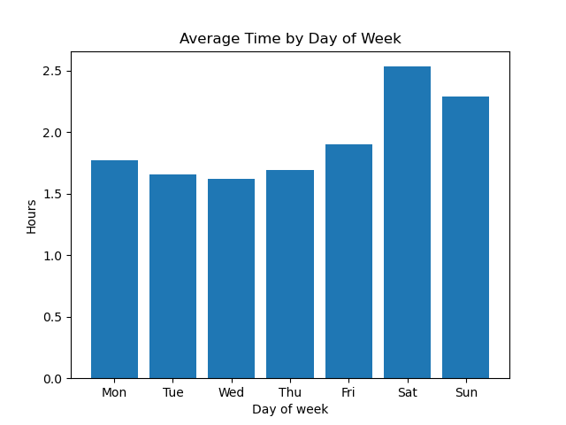
  <p><em>Figure 2.2 Average Time by Day of Week</em></p>
</div>

The difference is visible right away, on average I spent slightly more time on weekends.

However the next histogram says that I was a little bit more likely to work on weekdays.

<div align="center">
  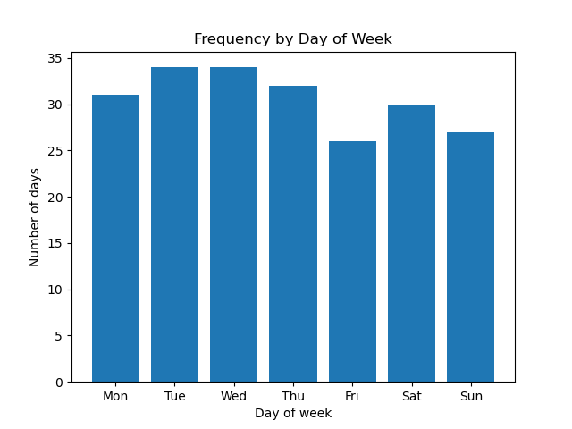
  <p><em>Figure 2.3 Frequency by Day of Week</em></p>
</div>

But still I spent more time on the project on Saturday and Sunday.

<div align="center">
  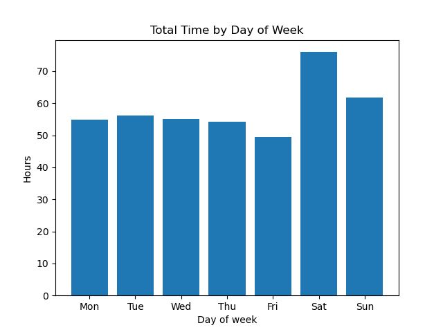
  <p><em>Figure 2.4 Total Time by Day of Week</em></p>
</div>

Finally, the last chart shows how many times I spent a given number of hours depending on a day of week.

<div align="center">
  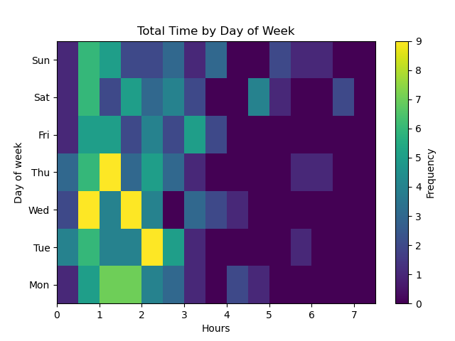
  <p><em>Figure 2.5 Total Time by Day of Week Heatmap</em></p>
</div>

It looks consistent with previous charts, there are more short days troughout the week, while longer sessions occur more frequently on weekends.

## Stats per Activity

Over the entire period, I recorded **317** activities. Since I worked more than once a day, the number of activities is higher than the number of days.

The first chart shows how many activities I had in a single day.

<div align="center">
  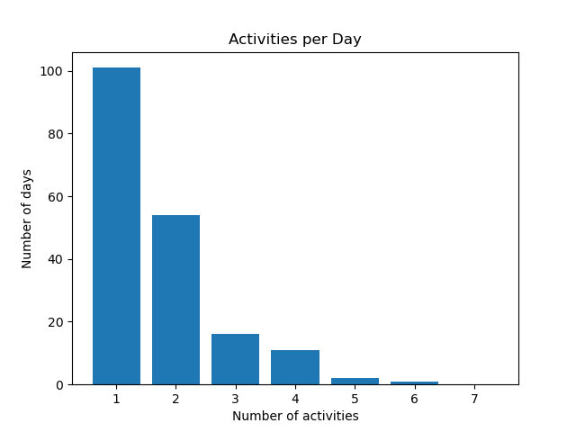
  <p><em>Figure 3.1 Activities per Day</em></p>
</div>

Most days consisted of just one activity. The histogram shows that this was the case for half of all days. Two activities in a single day were quite common, while three or more happened only occasionally.

<div align="center">
  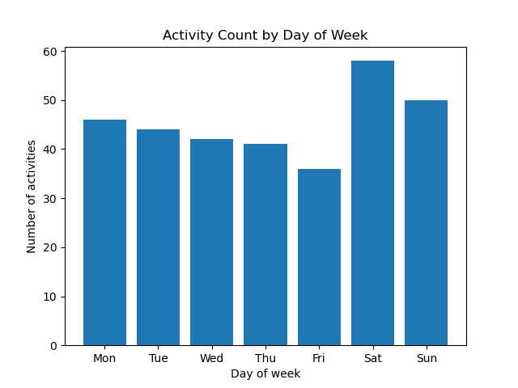
  <p><em>Figure 3.2 Activity Count by Day of Week</em></p>
</div>

Saturday has the highest amount of activities. This correlates very interestingly with Figure 2.4.

In the next chart I put this info in 2D histogram.

<div align="center">
  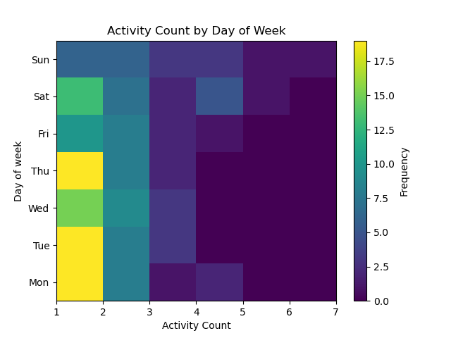
  <p><em>Figure 3.3 Activity Count by Day of Week Heatmap</em></p>
</div>

On weekdays, I would probably only have one session. This makes sense considering most of my work was done in the evenings after a regular job. Weekends were different, I was more likely to work more and have multiple sessions.
I could work on a project for a few hours and then still have the rest of the day for something else.

<div align="center">
  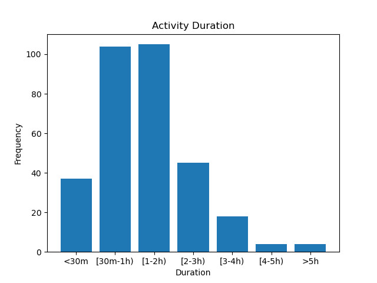
  <p><em>Figure 3.4 Activity Duration</em></p>
</div>

Most of the activities were short. On average, a single session lasted only **1.3** hours. That's not much, but enough to swich the context and get a meaningful piece of work done.

The shortest activity was **5** minutes and the longest lasted **6** hours. During such brief sessions I probably fixed some minor bugs. If I remember it right, I worked much longer, just treated it as a complete piece of work.

The final heatmap combines activity duration with the day of the week.

<div align="center">
  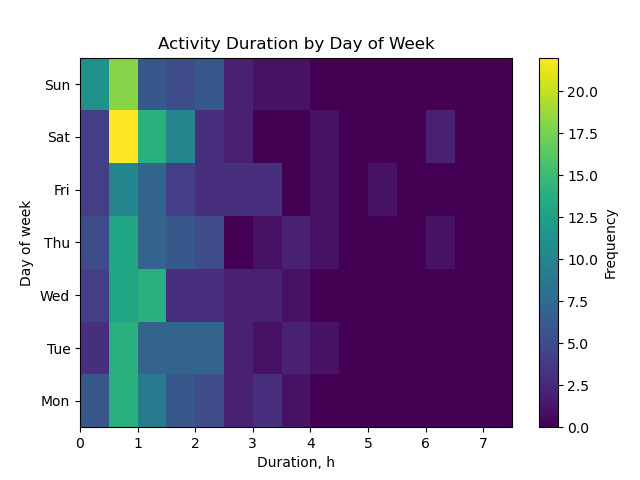
  <p><em>Figure 3.5 Activity Duration by Day of Week</em></p>
</div>

Short activities were common throughout the entire week. They appeared particularly often on Saturdays. I think this is because I simply had more sessions on Saturday, as shown on Figure 3.2.

## Stats per Time of Day

The next set of charts looks at **when** I worked. 

The first histogram shows the distribution of activity start and end times.

<div align="center">
  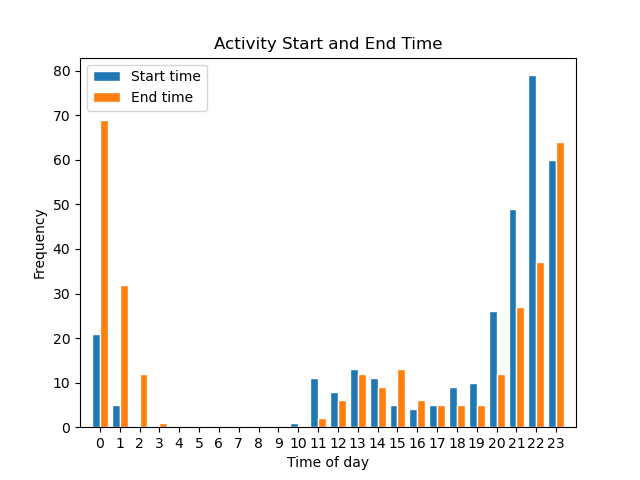
  <p><em>Figure 4.1 Activity Start and End Time</em></p>
</div>

Most sessions started around **10 PM** and finished close to **midnight**.

Next two heatmaps show the distribution activity start and end times for each day of week.

<div align="center">
  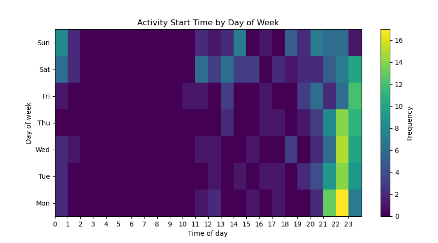
  <p><em>Figure 4.2 Activity Start Time by Day of Week</em></p>
</div>

<div align="center">
  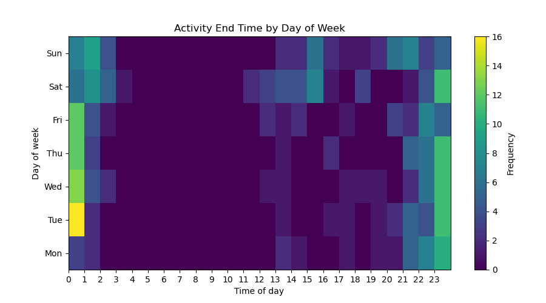
  <p><em>Figure 4.3 Activity End Time by Day of Week</em></p>
</div>

They clearly confirm the late-evening pattern that mostly happened on weekdays, while on Saturday and Sunday the time is more spread out.

In my opinion, the next heatmap is the most interesting. It shows when I was most likely to be working.

<div align="center">
  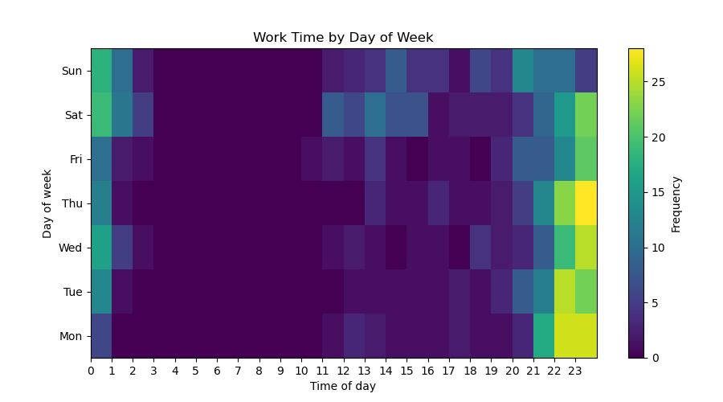
  <p><em>Figure 4.4 Work Time by Day of Week</em></p>
</div>

The result is exactly as expected, with the schedule mostly concentrated on weekday evenings. But keep in mind that Saturday has the highest total number of hours (Figure 2.4)

**Note for my manager:** the daytime work visible on this chart happened during holidays and vacations days. Not the office time :)

Finally, the last heatmap shows how my working schedule evolved over the entire period.

<div align="center">
  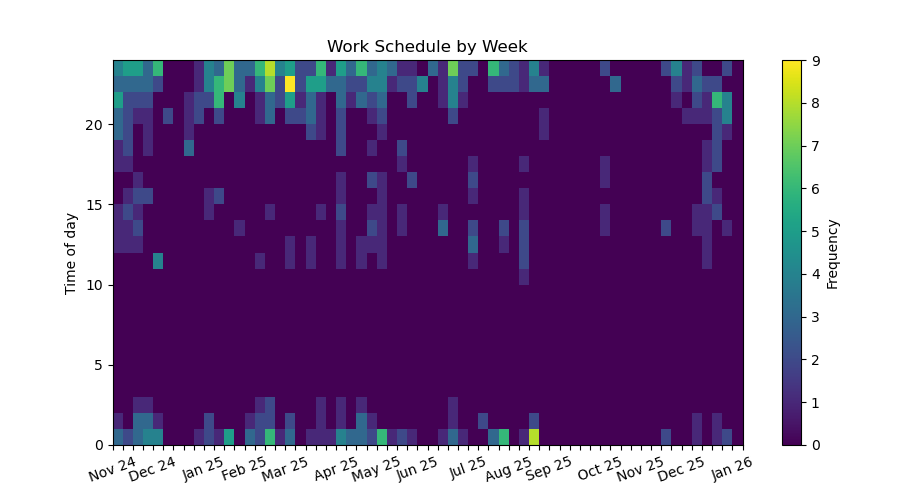
  <p><em>Figure 4.5 Work Schedule by Week</em></p>
</div>

I summed up the data by week to have it less noisy.

Not surprisingly, my working hours didn't change much. The only thing that's noticeable is that I had started working less.

## Tracked Time vs. Effective Time

While tracking time I was estimating how much time I actually spent working without distractions.

I ignored it until now so that the same set of data is used for for all calcualtions. 

Summing up all activities gives **367** hours of actual working time. That's about **90%** of the recorded time. The rest I spent on something else.

<div align="center">
  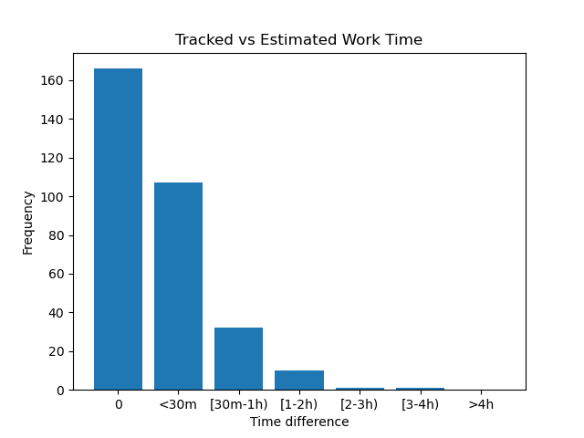
  <p><em>Figure 5.1 Tracked vs Estimated Work Time</em></p>
</div>

Most of the activities had no or little difference. But in fact, I think most of them had little difference, I just adjusted the timestamps to have nice and rounded values.

Plus I also think it gives such high productivity because the sessions were short, so there wasn't much chance of being distracted for long.

# Conclusion 

Looking back at the data, my working pattern looks like following: I would start working on a weekday around 10pm and finish around midnight, doing a small piece of work. Weekends gave me a little more time, but the project was mostly built during late evenings after work.


What have I learned?
Consistency is a key. Small steps matter a lot. I rarely spent an entire day on the project, yet those one- or two-hour sessions aadded up to over 400 hours of work.

I've been working on the project so often that it feels like a marathon now, and I'm not sure I could keep up that pace for long. And the charts clearly show periods when my motivation has dropped, including almost two months when I haven't touched the project at all.

I really overestimated how long it would take me to make the game. At first I thought it would be pretty simple and I could finish it in two or three months. In the end, I rewrote the project at least once and had to implement even the smallest details because I chose SFML. While I have nothing against writing things from scratch, I think I should have chosen an engine since my main goal was to have a game, not to learn.

Still, it's a bit sad to realize that such a small game takes up so much time when you're working full-time. Espesially for me because I have far more ideas than I have time to implement them. So, unfortunately, many of them will just remain in my head.

Nevertheless it was an amazing journey and I learned a lot along the way!

Finally, it's worth mentioning that this isn't a scientific dataset. Some entries are estimates, the way I estimated my time is subjective and I wasn't always consistent when recording the data. Even so, I think it shows a nice picture of what a year of building a side project alongside a full-time job actually looked like.

July 2026