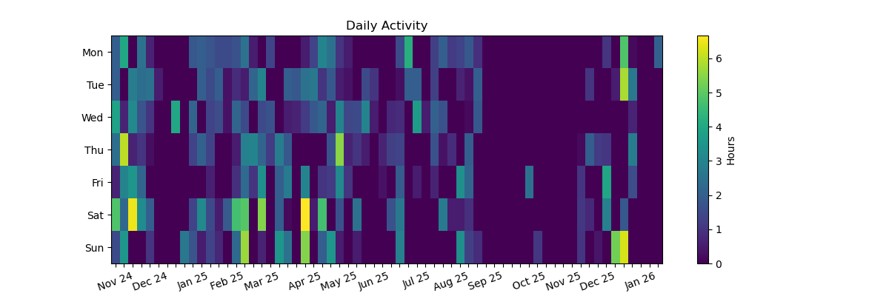

[cato_link]: https://github.com/ddimos/Cato

# Time Article
Throughout 2025, I worked on a side [project][cato_link]. This is a simple multiplayer game based on my and my friends' favorite card game. Every time I worked on it, I tracked the amount of time I spent on it.
In this article, I wanted to analyse the data I got, find some patterns, and just see what this year looked like.

***

Why did I decide to track my time? I wanted to see how much time I could realistically dedicate to a side project, working evenings and weekends, while still having a job and a fulfilling life.


I tracked my time in a simple text file, recording start time, end time, how much time I actually spent working, and a simple description of what I was doing. As for the last one, I wasn't very consistent, so I won't include it here. (It would be interesting to analyze it too).

```
30.06.25 21:20-01:00 ~2.5h
01.07.25 22:30-23:30 ~1h
23.06.25 21:10-21:50 ~40m
```

Throughout the article I'll be using start and end times to make analysis and later I'll compare it to the actual time I spent.

**Note:** One entry is one session or activity - a piece of complete work I did. There can be multiple activities in one day.

**Note 2:** I built a lot of charts, not all of them are really needed. I love creating charts!

***
***

Let's start by looking at the heatmap



...